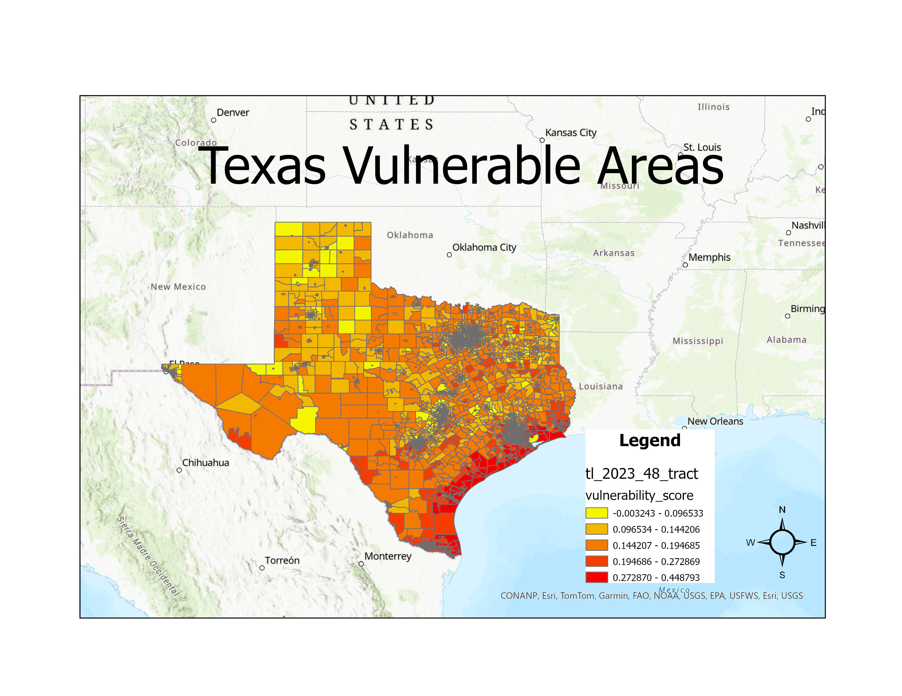
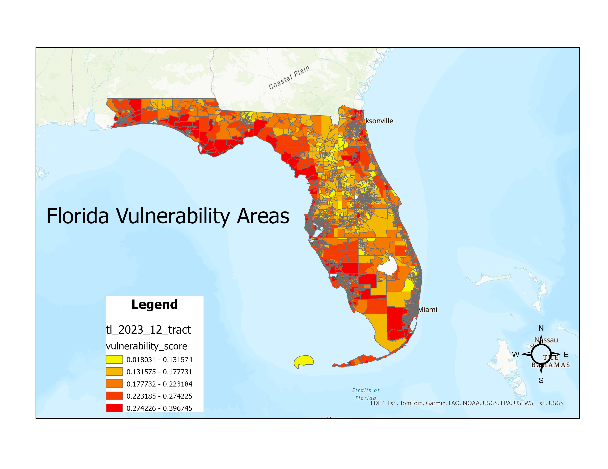
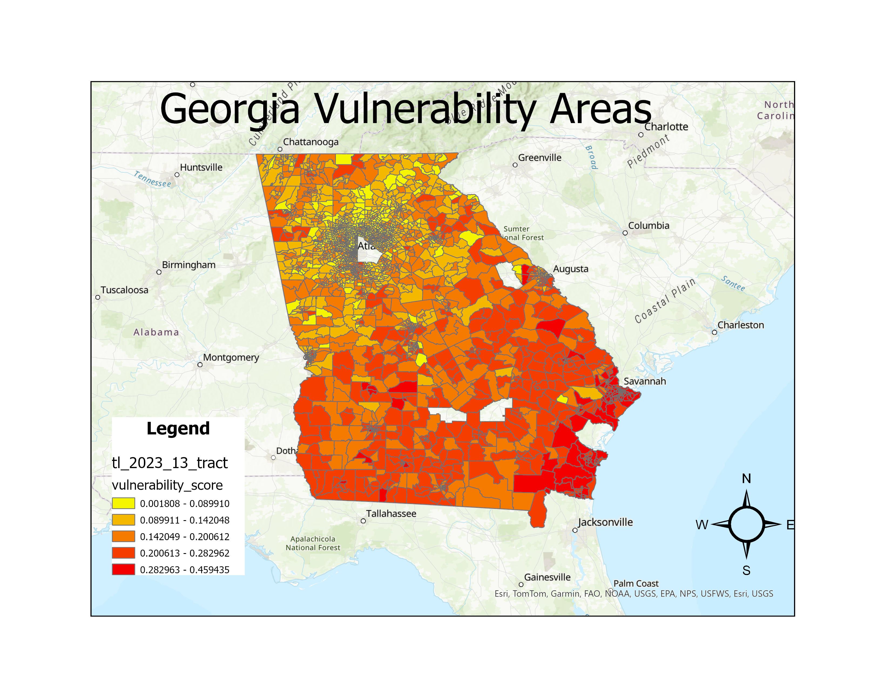
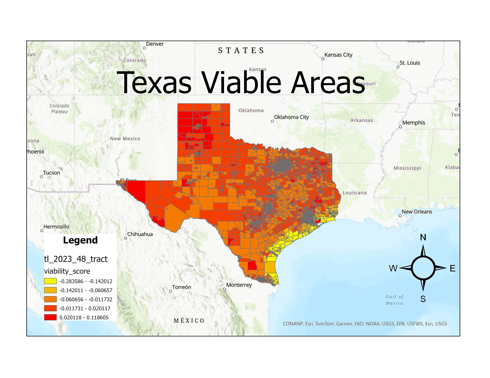
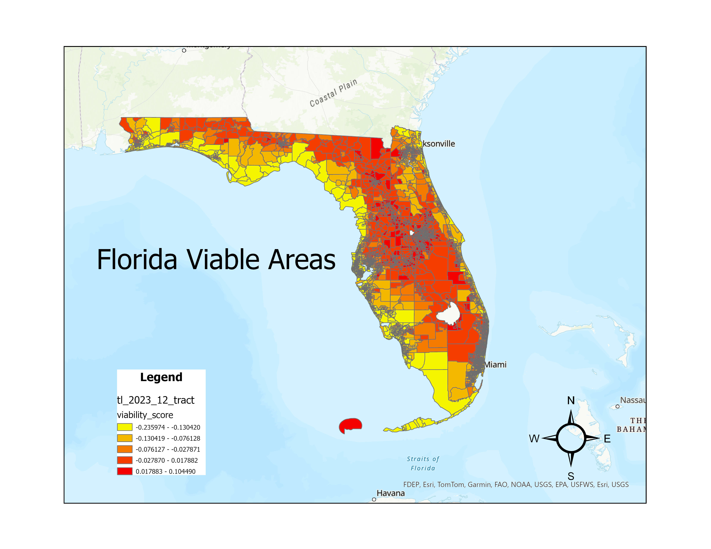
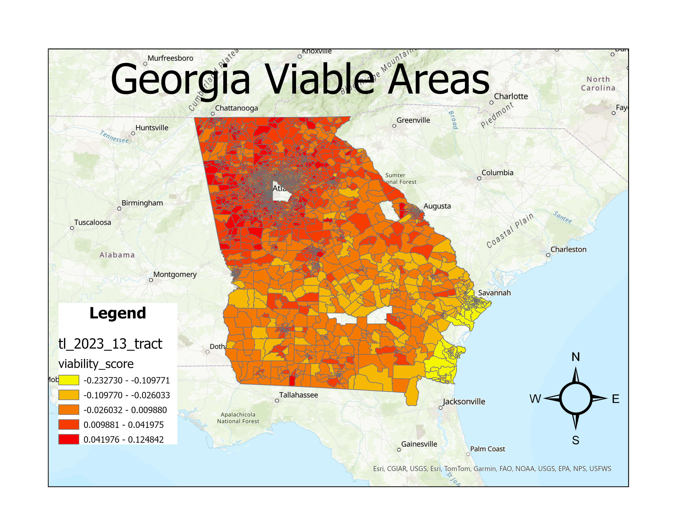

# Datathon Project: Estimating Vulnerable Areas in Texas, Georgia, and Florida

This project was part of a datathon that tasked participants with creating a model to estimate areas in Texas, Georgia, and Florida that are low income and vulnerable to flooding.

## Project Structure

- `_Datathon_Project_1.ipynb`: Main Jupyter Notebook containing the data processing and model development.
- `Distance_Calculator.ipynb`: Additional notebook for calculating distances (if applicable).

## Data Sources

The project uses various datasets stored in Google Drive, which are mounted and read into the notebook. The datasets include financial, housing, income, poverty, FEMA, and crime statistics for Texas, Georgia, and Florida.

If you are following along with the set-up, ensure you mount these files to your own Google Drive.

### Datasets

- **Texas**
  - Financial: `TX_fin.csv`
  - Housing: `TX_housing.csv`
  - Income: `TX_income.csv`
  - Poverty: `TX_pov.csv`
  - FEMA: `NRI_Table_CensusTracts_TX_short.csv`
  - Crime: `TX_Crime.csv`
  - Extra: `National_Risk_Index_Census_Tracts_-8585410214735344663.csv`

- **Florida**
  - Financial: `FL_fin.csv`
  - Housing: `FL_housing.csv`
  - Income: `FL_income.csv`
  - Poverty: `FL_pov.csv`
  - FEMA: `NRI_Table_CensusTracts_FL_short.csv`
  - Crime: `FL_Crime.csv`
  - Extra: `National_Risk_Index_Census_Tracts_-6165271459456834372.csv`

- **Georgia**
  - Financial: `GA_fin.csv`
  - Housing: `GA_housing.csv`
  - Income: `GA_income.csv`
  - Poverty: `GA_pov.csv`
  - FEMA: `NRI_Table_CensusTracts_GA_short.csv`
  - Crime: `GA_Crime.csv`
  - Extra: `National_Risk_Index_Census_Tracts_172774781750251725.csv`

## Setup

1. **Mount Google Drive**:
    ```python
    from google.colab import drive
    drive.mount('/content/drive', force_remount=True)
    ```

2. **Import Libraries**:
    ```python
    import pandas as pd
    import numpy as np
    ```

3. **Load Data**:
    ```python
    TX_fin = pd.read_csv("/content/drive/My Drive/Datathon/TX_fin.csv")
    TX_housing = pd.read_csv("/content/drive/My Drive/Datathon/TX_housing.csv")
    TX_income = pd.read_csv("/content/drive/My Drive/Datathon/TX_income.csv")
    TX_pov = pd.read_csv("/content/drive/My Drive/Datathon/TX_pov.csv")
    TX_FEMA = pd.read_csv("/content/drive/My Drive/Datathon/NRI_Table_CensusTracts_TX_short.csv")
    TX_crime = pd.read_csv('/content/drive/My Drive/Datathon/TX_Crime.csv')
    TX_extra = pd.read_csv('/content/drive/My Drive/Datathon/National_Risk_Index_Census_Tracts_-8585410214735344663.csv', encoding='utf8', encoding_errors='ignore')

    FL_fin = pd.read_csv("/content/drive/My Drive/Datathon/FL_fin.csv")
    FL_housing = pd.read_csv("/content/drive/My Drive/Datathon/FL_housing.csv")
    FL_income = pd.read_csv("/content/drive/My Drive/Datathon/FL_income.csv")
    FL_pov = pd.read_csv("/content/drive/My Drive/Datathon/FL_pov.csv")
    FL_FEMA = pd.read_csv("/content/drive/My Drive/Datathon/NRI_Table_CensusTracts_FL_short.csv")
    FL_crime = pd.read_csv('/content/drive/My Drive/Datathon/FL_Crime.csv')
    FL_extra = pd.read_csv('/content/drive/My Drive/Datathon/National_Risk_Index_Census_Tracts_-6165271459456834372.csv', encoding='utf8', encoding_errors='ignore')

    GA_fin = pd.read_csv("/content/drive/My Drive/Datathon/GA_fin.csv")
    GA_housing = pd.read_csv("/content/drive/My Drive/Datathon/GA_housing.csv")
    GA_income = pd.read_csv("/content/drive/My Drive/Datathon/GA_income.csv")
    GA_pov = pd.read_csv("/content/drive/My Drive/Datathon/GA_pov.csv")
    GA_FEMA = pd.read_csv("/content/drive/My Drive/Datathon/NRI_Table_CensusTracts_GA_short.csv")
    GA_crime = pd.read_csv('/content/drive/My Drive/Datathon/GA_Crime.csv')
    GA_extra = pd.read_csv('/content/drive/My Drive/Datathon/National_Risk_Index_Census_Tracts_172774781750251725.csv', encoding='utf8', encoding_errors='ignore')
    ```

## Analysis and Model Development

The notebook `_Datathon_Project_1.ipynb` contains the following steps:

1. **Data Cleaning**: Handling missing values, encoding errors, and dropping unnecessary rows.
2. **Exploratory Data Analysis (EDA)**: Visualizing the data to understand distributions and relationships.
3. **Feature Engineering**: Creating new features that may help in predicting vulnerable areas.
4. **Model Training**: Developing and training machine learning models to estimate low-income and flood-vulnerable areas.
5. **Evaluation**: Assessing the model's performance using appropriate metrics.

## Results

The results of the analysis and model predictions are documented within the notebook, as well as the visualizations. Here are some key visualizations:

### Vulnerability Data
- 
- 
- 

### Viablity Data
- 
- 
- 


## Conclusion

This project demonstrates the use of various datasets and machine learning techniques to address a real-world problem. The insights gained from this analysis can help in making informed decisions to support vulnerable communities.

## Acknowledgements

Special thanks to the NYU DSC organizers and CBRE for providing theresources to complete this project.

